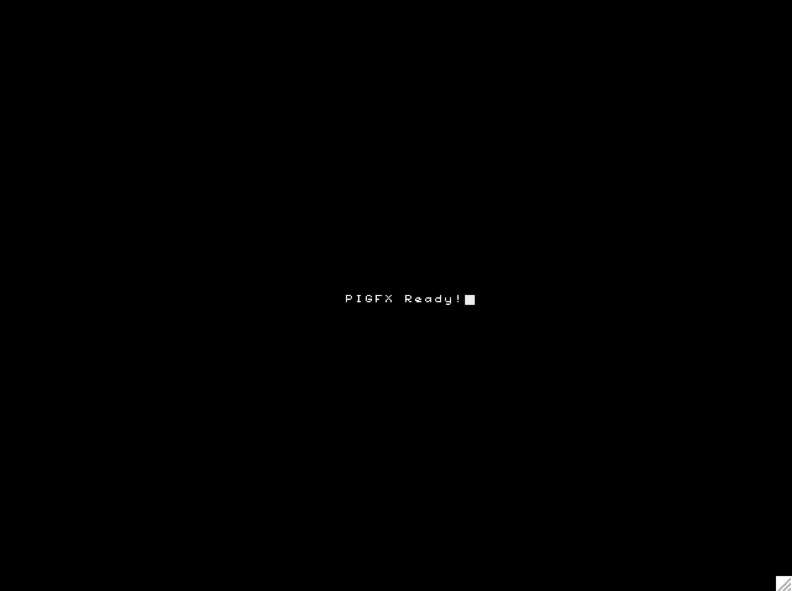
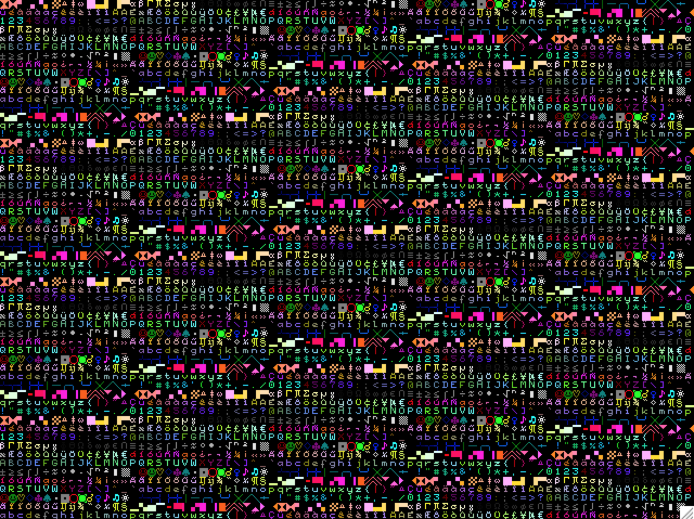

# PiGFX 
## Raspberry Pi graphics card / ANSI terminal emulator

 

PiGFX is a bare metal code for the Raspberry Pi that implements a basic ANSI
terminal emulator and some primitive graphics functions. It can be driven by
pushing characters to the raspi UART with a basic support for ANSI escape codes
to change text color, move cursor etc. 
The result is that you can easily add an HDMI display output to your embedded
project without the hassle of directly generate the video signal.

This work is inspired by
[Spencer](https://hackaday.io/project/9567-5-graphics-card-for-homebrew-z80)
whose aim was to create a cheap graphics card and keyboard interface to its
homebrew Z80 computer. PiGFX has the advantage of removing the fuss of having a
full-featured Linux system running on your raspi. This dramatically decreases
the boot time, lets the system be more customizable and, of course, adds a lot
of fun :) 


By now this is a work in progress with a minimum set of features implemented
so expect that more functionalities will be added from time to time.


Here is a preliminary TODO list of what I plan to add in the future:

- Add some graphics primitives like lines/circles/rectangles etc.
- Add support for USB or Ps2 keyboard
- Let the resolution being configurable without recompiling
- Implement double buffering
- Load bitmap fonts directly from the SD card


## How to run

1. Format an SD-card with FAT32 filesystem.
2. Copy ```bin/kernel.img``` in the root of the SD card along with the files
   ```start.elf``` and ```bootcode.bin``` that are commonly [distributed with
the Raspberry Pi](https://github.com/raspberrypi/firmware/tree/master/boot)
3. Insert the card and reboot the Pi.

As soon as your raspi is turned on, the message "PIGFX Ready!" should be
displayed as a 640x480 @ 60hz video stream from the HDMI interface. Any data
received from the UART is immediately displayed in a terminal-like fashion.


### Test inside QEMU

PiGFX can be tested with [QEMU](http://wiki.qemu.org/Main_Page). Just
download/compile/install the [Rpi Torlus
branch](https://github.com/Torlus/qemu/tree/rpi) and launch 

```
$ make run
```

in the PiGFX root folder.


## UART Physical connection

Pin   | Function
---   |---
8     | UART Tx0 (GPIO 14)  (Not used yet)
10    | UART Rx0 (GPIO 15). Connect this pin to your device transmit pin.


***Note: Please be aware that all Raspberry Pi models accept levels between 0 and +3.3V. Be sure to provide an appropriate level shifter to match your output***

UART communication expects a baud rate of 115200 baud, 8 bit data, 1 bit
stop and no parity.


## Terminal ANSI Codes

The following escape sequences can be used to further control the terminal
behaviour

Code                  | Command
---                   | ---
| \ESC[?25l          | Cursor invisible
| \ESC[?25h          | Cursor visible
| \ESC[H             | Move to 0-0
| \ESC[s             | Save the cursor position 
| \ESC[u             | Move cursor to previously saved position 
| \ESC[-Row-;-Col-H    | Move to -Row-,-Col-
| \ESC[0K            | Clear from cursor to the end of the line
| \ESC[1K            | Clear from the beginning of the current line to the cursor 
| \ESC[2K            | Clear the whole line 
| \ESC[2J            | Clear the screen and move the cursor to 0-0 
| \ESC[-n-A          | Move the cursor up -n- lines
| \ESC[-n-B          | Move the cursor down -n- lines
| \ESC[-n-C          | Move the cursor forward -n- characters
| \ESC[-n-D          | Move the cursor backward -n- characters
| \ESC[0m            | Reset color attributes (white on black) 
| \ESC[38;5;-n-m     | Set foreground color to -n- (0-255) 
| \ESC[48;5;-n-m     | Set background color to -n- (0-255) 


Where ```\ESC``` is the binary character ```0x1B``` and ```-n-```,
```-Row-```, ```-Col-``` is any sequence of numeric characters like ```123```.

See [Here](https://en.wikipedia.org/wiki/File:Xterm_256color_chart.svg) for a
reference of the provided xterm color palette.


## Compiling

To compile you will need to install a GNU ARM cross compiler toolchain and
ensure that  ```arm-none-eabi-gcc```, ```arm-none-eabi-as```
```arm-none-eabi-ld``` and ```arm-none-eabi-objcopy``` are in your PATH.

At this point, just run:

```
$ make
$ make kernel
```

in the PiGFX root directory.
 


## License

The MIT License (MIT)

Copyright (c) 2016 Filippo Bergamasco.

Permission is hereby granted, free of charge, to any person obtaining a copy
of this software and associated documentation files (the "Software"), to deal
in the Software without restriction, including without limitation the rights
to use, copy, modify, merge, publish, distribute, sublicense, and/or sell
copies of the Software, and to permit persons to whom the Software is
furnished to do so, subject to the following conditions:

The above copyright notice and this permission notice shall be included in
all copies or substantial portions of the Software.

THE SOFTWARE IS PROVIDED "AS IS", WITHOUT WARRANTY OF ANY KIND, EXPRESS OR
IMPLIED, INCLUDING BUT NOT LIMITED TO THE WARRANTIES OF MERCHANTABILITY,
FITNESS FOR A PARTICULAR PURPOSE AND NONINFRINGEMENT. IN NO EVENT SHALL THE
AUTHORS OR COPYRIGHT HOLDERS BE LIABLE FOR ANY CLAIM, DAMAGES OR OTHER
LIABILITY, WHETHER IN AN ACTION OF CONTRACT, TORT OR OTHERWISE, ARISING FROM,
OUT OF OR IN CONNECTION WITH THE SOFTWARE OR THE USE OR OTHER DEALINGS IN
THE SOFTWARE.

