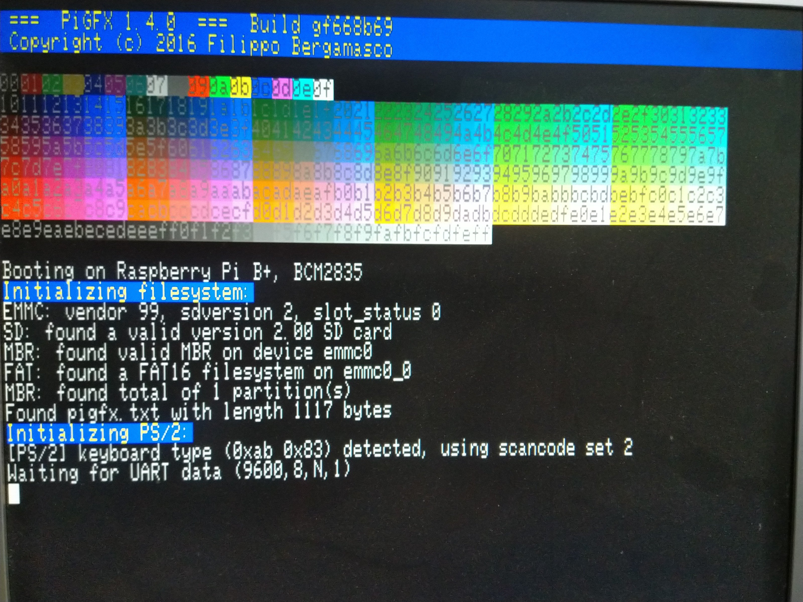
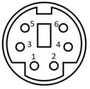

# PiGFX 
## Raspberry Pi graphics card / ANSI terminal emulator




PiGFX is a bare metal kernel for the Raspberry Pi that implements a basic ANSI
terminal emulator with the additional support of some primitive graphics
functions. It can be driven by pushing characters to the raspi UART. Additional
functions like changing text color, moving the cursor or clear the screen can
be invoked via ANSI escape codes.  The result is that you can easily add an
HDMI display output to your embedded project without the hassle of directly
generate the video signal.

This work is inspired by [Spencer's
project](https://hackaday.io/project/9567-5-graphics-card-for-homebrew-z80)
that aims to create a cheap graphics card and keyboard interface to its
homebrew Z80 computer. PiGFX has the advantage of removing the fuss of having a
full-featured Linux system running on your raspi. This dramatically decreases
the boot time, lets the system be more customizable and, of course, adds a lot
of fun :) 

*UPDATE*: Thanks to the [uspi](https://github.com/rsta2/uspi) bare-metal USB
driver PiGFX now support an external USB keyboard as input device. Anything
typed will be automatically sent to raspi UART Tx0 (pin 8, GPIO 14).

*UPDATE*: (2018 Nov. by F. Pierot) Added display modes, fonts, tabulation set... See [2018 Nov. modifications](README_ADD.md).

*UPDATE*: (2020 by Ch. Lehner) Added new graphic features and configurable baudrate. Fixed some bugs. Ported to Raspberry Pi 2, 3 and 4. Also included the ability to read a config file on the SD card. Also added support for PS/2 keyboards.

By now this is a work in progress with a minimum set of features implemented so
expect that more functionalities will be added from time to time.

PiGFX should be working on all Pi models from generation 1 to generation 4. However there is no USB support on the model 4. It's tested on the following models:

- Pi Zero
- Pi Zero W
- Pi B
- Pi B+
- Pi 2B
- Pi 3B
- Pi 4B


Here is a preliminary TODO list of what I plan to add in the future:

- ✔ Add support for USB or Ps2 keyboard
- ✔ Add some graphics primitives like lines
- ✔ Add some more graphics primitives (circles, rectangles etc.)
- ✔ Let the resolution being configurable without recompiling
- ✔ Port to Raspberry Pi Generation 2/3/4
- ✔ Load configuration from SD card
- ✔ Support for PS/2 keyboard
- Implement some kind of sprite handling with collision detection
- Implement double buffering
- Load bitmap fonts directly from the SD card
- Implement a 8bit interface
- Support for USB / PS/2 Mouse

## How to run

1. Format an SD-card: you need one 1 GB partition using the FAT or FAT32 system. 
Other formats won't boot, and a bigger size is useless. Avoid 64GB+ cards as 
they tend to cause problems to PI. A 32GB or 16GB card is ok as long as you 
format only 1 or 2 GB with FAT or FAT32.

2. Copy all ```bin/*.img``` to the root of the SD card along with the files
   ```start.elf```, ```start4.elf``` and ```bootcode.bin``` that are commonly [distributed with
the Raspberry Pi](https://github.com/raspberrypi/firmware/tree/master/boot).

3. Copy ```bin/pigfx.txt``` to the root of the SD card. Edit the file for your
   needs. If you have a config.txt on the SD card, delete it.

4. Insert the card and reboot the Pi.

As soon as your raspi is turned on, the boot screen and other informations 
should be displayed as a 640x480 @ 60hz video stream from the HDMI interface. 
After that, PiGFX awaits anything coming from the serial line. Any data
received from the UART is immediately displayed in a terminal-like fashion (ie.
it automatically scrolls once you reach the bottom of the screen, etc.).

You may need to reset your computer before PiGFX displays anything coming from it.
 
### Test inside QEMU

PiGFX can be emulated with [QEMU](http://wiki.qemu.org/Main_Page). Just
download/compile/install the [rpi Torlus
branch](https://github.com/Torlus/qemu/tree/rpi) and launch 

```
$ make run
```

in the PiGFX root folder.


## UART Physical connection

|Pin   | Function
|---   |---
|8     | UART Tx0 (GPIO 14).  Keyboard output
|10    | UART Rx0 (GPIO 15). Connect this pin to your device transmit pin.


***Note: Please be aware that all Raspberry Pi models accept levels between 0 and 3v3. Be sure to provide an appropriate level shifter to match your output***

UART communication expects the baudrate configured in pigfx.txt, 8 bit data, 1 bit
stop and no parity.


## PS/2 keyboard
Be aware that USB support is disabled, if a PS/2 keyboard is detected during boot. This increases boot time a lot.

### Physical connection to the Pi
This is the male connector at the keyboard cable.



Most keyboards seem to work if powered with 3.3V. However if your keyboard does not and needs 5V, make sure you use a bidirectional level shifter between the Raspberry Pi and your keyboard on data and clock. If you bring 5V to the GPIO you will destroy the Pi.

|PS/2 Pin |Pi Pin | Function
|-------  |-----  |---------
|1        |3      | PS/2 Data (GPIO 2)
|3        |9      | Ground
|4        |1      | Power to keyboard
|5        |5      | PS/2 Clock (GPIO 3)

## Terminal ANSI Codes

The following escape sequences can be used to further control the terminal
behaviour

|Code                  | Command
|---                   | ---
| \ESC[?25l           | Cursor invisible
| \ESC[?25h           | Cursor visible
| \ESC[H              | Move to 0-0
| \ESC[s              | Save the cursor position 
| \ESC[u              | Move cursor to previously saved position 
| \ESC[-Row-;-Col-H   | Move to -Row-,-Col-
| \ESC[0K             | Clear from cursor to the end of the line
| \ESC[1K             | Clear from the beginning of the current line to the cursor 
| \ESC[2K             | Clear the whole line 
| \ESC[2J             | Clear the screen and move the cursor to 0-0 
| \ESC[-n-A           | Move the cursor up -n- lines
| \ESC[-n-B           | Move the cursor down -n- lines
| \ESC[-n-C           | Move the cursor forward -n- characters
| \ESC[-n-D           | Move the cursor backward -n- characters
| \ESC[0m             | Reset color attributes (white on black) 
| \ESC[38;5;-n-m      | Set foreground color to -n- (0-255) 
| \ESC[48;5;-n-m      | Set background color to -n- (0-255) 


Where ```\ESC``` is the binary character ```0x1B``` and ```-n-```,
```-Row-```, ```-Col-``` is any sequence of numeric characters like ```123```.

Additionally, PiGFX implements the following custom codes:


Code                              | Command
---                               | ---
| \ESC[#-x0-;-y0-;-x1-;-y1-l     | Draw a line from -x0-;-y0- to -x1-;-y1-
| \ESC[#-x0-;-y0-;-x1-;-y1-r     | Fill a rectangle with top-left corner at -x0-;-y0- and bottom-right at -x1-;-y1-

See [terminal_codes](doc/terminal_codes.txt) for a complete list of supported commands.


See [Here](https://en.wikipedia.org/wiki/File:Xterm_256color_chart.svg) for a
reference of the provided xterm color palette.

## Bitmap handling
A maximum of 128 bitmaps can be loaded to the PiGFX, either as list of pixels, or REL compressed. Loaded bitmaps can then be put on the background. A transparent color can be specified, these pixels won't be drawn. REL compression expects a list of 2 byte values: first byte is the pixel color, second byte is the number of pixels to draw with this color.

See [terminal_codes](doc/terminal_codes.txt) for the specific commands.

There are 2 examples for loading bitmaps: [load bitmap](shapes/load_bitmap_sample.bin), [load REL bitmap](shapes/load_rel_bitmap_sample.bin).

The Xterm palette is used. A RGB pixel can be converted to this palette by the following formula.

Pixel = 16 + (round(R / 255 * 5) * 36) + (round(G / 255 * 5) * 6) + round(B / 255 * 5)

## Compiling on Mac / Linux

To compile you will need to install a GNU ARM cross compiler toolchain and
ensure that  ```arm-none-eabi-gcc```, ```arm-none-eabi-as```
```arm-none-eabi-ld``` and ```arm-none-eabi-objcopy``` are in your PATH.

At this point, just run:

```
$ ./makeall
```

in the PiGFX root directory. The project should compile with the 2019 version
of the toolchain.


## Compiling on Windows

To compile you will need to install a [GNU ARM cross compiler toolchain](https://developer.arm.com/tools-and-software/open-source-software/developer-tools/gnu-toolchain/gnu-rm/downloads) and
ensure that  ```arm-none-eabi-gcc```, ```arm-none-eabi-as```
```arm-none-eabi-ld``` and ```arm-none-eabi-objcopy``` are in your PATH.

You'll also need the [git executable git.exe](https://git-scm.com/download/win) in your PATH.

At this point, just run:

```
> makeall
```

## License

The MIT License (MIT)

Copyright (c) 2016-2020 Filippo Bergamasco.

Permission is hereby granted, free of charge, to any person obtaining a copy
of this software and associated documentation files (the "Software"), to deal
in the Software without restriction, including without limitation the rights
to use, copy, modify, merge, publish, distribute, sublicense, and/or sell
copies of the Software, and to permit persons to whom the Software is
furnished to do so, subject to the following conditions:

The above copyright notice and this permission notice shall be included in
all copies or substantial portions of the Software.

THE SOFTWARE IS PROVIDED "AS IS", WITHOUT WARRANTY OF ANY KIND, EXPRESS OR
IMPLIED, INCLUDING BUT NOT LIMITED TO THE WARRANTIES OF MERCHANTABILITY,
FITNESS FOR A PARTICULAR PURPOSE AND NONINFRINGEMENT. IN NO EVENT SHALL THE
AUTHORS OR COPYRIGHT HOLDERS BE LIABLE FOR ANY CLAIM, DAMAGES OR OTHER
LIABILITY, WHETHER IN AN ACTION OF CONTRACT, TORT OR OTHERWISE, ARISING FROM,
OUT OF OR IN CONNECTION WITH THE SOFTWARE OR THE USE OR OTHER DEALINGS IN
THE SOFTWARE.
